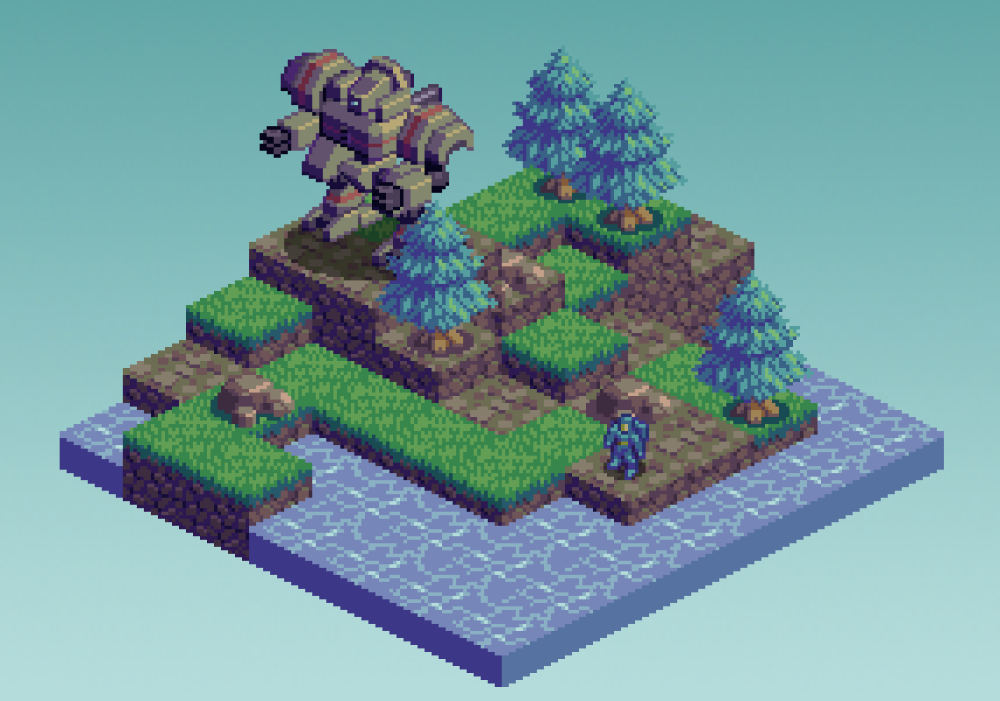
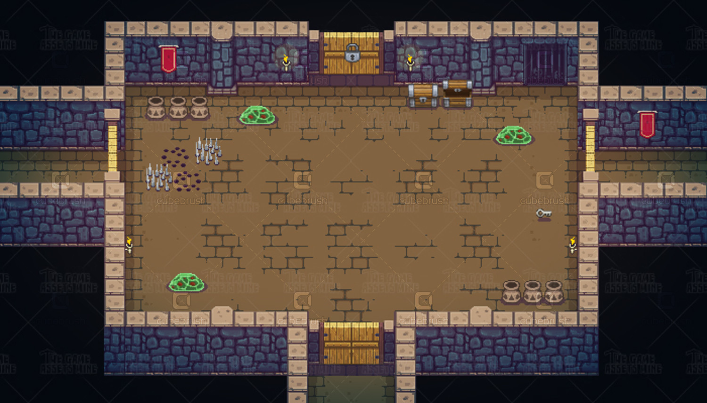
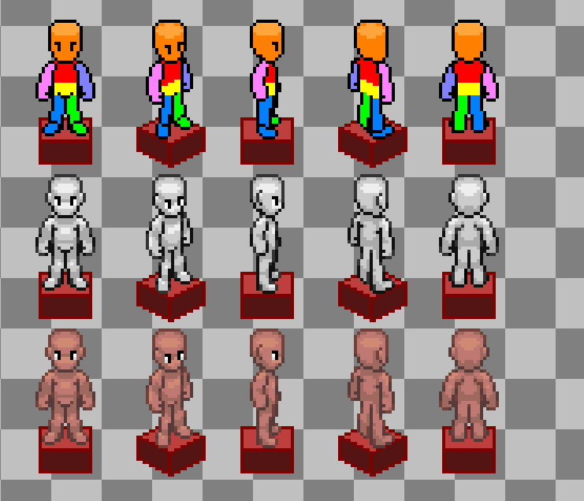

# **Asset Guide**

> **Document Status:** Updated \
**Last Updated:** Sept. 30, 2025 \
**Stage**: Preliminary 

## **Introduction**

Due to the design of the farming game's, graphics will be a vital component of the project.
The game will leverage two distinct perspectives, each will be utilized differently.

### **Perspectives**
- **Isometric Perspective**:
used in the overworld where it is important for the players to have the **2.5D** feel of the game environment 
**_[[Click here for a guide]](https://www.slynyrd.com/blog/2022/11/28/pixelblog-41-isometric-pixel-art)_**

- **Topdown Perspective**:
used in the battle system of game where simplicity is important since the battle system will be a real-time system
**_[[Click here for a guide]](https://www.slynyrd.com/blog/2019/9/18/pixelblog-21-top-down-objects)_**

> _**Note:** There will be more assets needed for the isometric perspective._

The game will also leverage a cute/charming feel to portray the game as a chill game where players think it's a typical farming game.
It is encouraged to use **[Pixel art](https://www.sandromaglione.com/articles/getting-started-with-pixel-art)** for the assets in both perspectives.

## **Assets Needed**

For the **_MVP_** version of the game, the following assets are needed
> _**Note 1:** Asset canvas should be **32 x 32** pixels per sprite if not specified_

### **Terrain Blocks**
- Grass
- Soil
- Sand
- Stone
- Gravel
- Bush
- Tall Bush (**32 x 64**)
- Log
- Weed
- Flowers
- Water
- Small tree (**32 x 64**)
- Tree (**64 x 128**)

### **Characters**
_(Since this is still the preliminary stage, try experimenting with any character)_

> _**Note 2:** Character sprites have 5 directions in isometric perspective._
